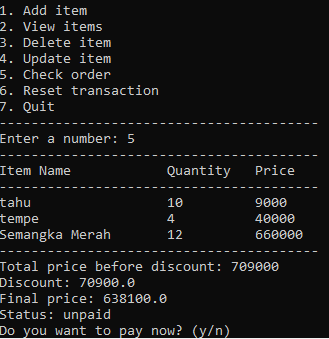

## Pacmann Project Python

#### Background of the Problem

Andi, the owner of a large supermarket in a city in Indonesia, is looking to improve his business by implementing a self-service cashier system. This system would allow customers to input the items they wish to purchase, including quantity and price per item, as well as other features. This would also allow customers who do not live in the city to purchase from the supermarket remotely. After conducting research, Andi has identified a need for a programmer to develop and implement this feature for his supermarket.

#### Requirements / Objectives

- Save transaction
- Add items (product name, quantity, price per item)
- Update item (product name, quantity, price per item)
- Delete item
- Reset transaction
- Warning if there are error input
- Discount with several conditions

#### Flowchart

The cashier app program operates as a self-service system, beginning with displaying the menu options to the customer. There are a total of 7 menu items, as shown in the accompanying image :

Customers can add items to their order by selecting menu option `1 (Add item)`. However, before making a selection, it is important to note that inputting an incorrect menu choice, such as number 8 or non-digit characters, will result in an error message **"Invalid selection. Try again."** as shown in the accompanying images.

  

After selecting the correct menu as displayed, customers can add items to their transaction by choosing menu option `1 (Add item)`. They will then be prompted to input the product name, quantity, and price per item. Once these details have been successfully input, the customer will be asked if they wish to add more items to the transaction. If they choose to do so, they should input **"y"**, otherwise, they should input **"n"** if they do not wish to add any more items.

If the customer chooses to add more items, they will be prompted to input the product details (**product name, quantity, and price per item**) as before, and the process will repeat until the customer chooses to end the transaction by inputting **"n"**.

By selecting menu option `2 (View items)`, customers can view all of the items they have added to their transaction, including the product name, quantity, and the total price per product.

Menu option `4 (Update item)` allows customers to make changes to items they have already added to their transaction. After selecting this menu, a list of products that have been input will be displayed. Customers can then select the number of the product they wish to update and make necessary changes.

For example, if a customer wants to update item number 3 (Semangka) they would select number 3 from the list of products. The customer would then be presented with the option to update the `product name (1)`, `quantity (2)`, `price per item (3)` or to `cancel the update (4)`. The latter option would return the customer to the main menu in case they have chosen the wrong product to update.

If the customer chooses menu `option 1`, they will be prompted to input the new name of the product. For example, if they initially input the name of the product as `semangka` and later realize it should be `Semangka Merah`, they can update the name in this menu.

If the customer chooses menu `option 2`, they will be prompted to input the new quantity of the product. For example, if they initially input the quantity as `2` and later realize they want to change it to `12`, they can update the quantity in this menu.

If the customer chooses menu `option 3`, they will be prompted to input the new price per item of the product. For example, if they initially input the price per item as `50000` and later realize they want to change it to `55000`, they can update the price in this menu.

By selecting menu option `5 (Check order)`, the program will display a summary of the customer's order, including a list of the products, their quantities, and the total price per product. It will also show the total price before any discounts are applied, any discounts that are applied based on the conditions, the final price, and the payment status (`paid` or `unpaid`). If the order is unpaid, the customer will be given the option to pay now.  
The details of the discount are as follows:

- A `10% discount` is applied if the total price is greater than 500000.
- An `8% discount` is applied if the total price is greater than 300000 but less than or equal to 500000.
- A `5% discount` is applied if the total price is greater than 200000 but less than or equal to 300000.
- `No discount` is applied if the total price is less than or equal to 200000.

When the customer chooses to pay, the system will prompt them to input the amount they are paying. If the input amount is more than the total price, the system will calculate the change and update the payment status to `Paid`

That is one scenario of how the cashier app program works, starting with adding items to the transaction and ending with payment. 

Another scenario could involve adding, deleting, and resetting items in the transaction. The accompanying image illustrates an example of 8 items that have been input into the system.

Another menu option that we have not yet discussed is menu option `3 (Delete item)`. When the customer selects this option, they will be presented with a list of products that they have added to their transaction, they can simply enter the number of the product they wish to delete as it is shown in the list.

Once the customer has selected the number of the product they wish to delete, for example no.1 (tahu), the system will prompt the customer to confirm if they are sure they want to delete the item. If they confirm that they want to delete the item, they should press **"y"**, otherwise they should press **"n"** to cancel the delete operation.

Once the customer confirms they want to delete the item by inputting **"y"**, the system will delete the product and give the information **"item deleted"** to confirm that the item has been removed from the transaction.

To confirm that the product number 1 (**tahu**) has been deleted, the customer can select menu option `2 (View items)` again and check the list of products in the transaction. The item (**tahu**) should no longer be present in the list, indicating that it has been successfully deleted from the transaction.

If the customer finds that deleting items one by one is too time-consuming, they can use menu option `6 (Reset transaction)` to delete all items at once. However, as with other operations such as deletion or update, the customer will be prompted to confirm that they want to proceed with resetting the transaction. They can press **"y"** to confirm or **"n"** to cancel the operation.

When the customer confirms that they want to reset the transaction by pressing **"y"**, the system will delete all the items and give the information "Transaction reset." as an information that the transaction has been reset.

To confirm that all items have been deleted, the customer can check using menu option `2 (View items)`. The list of products in the transaction should now be empty, as shown in the accompanying image, indicating that the transaction has been successfully reset.

